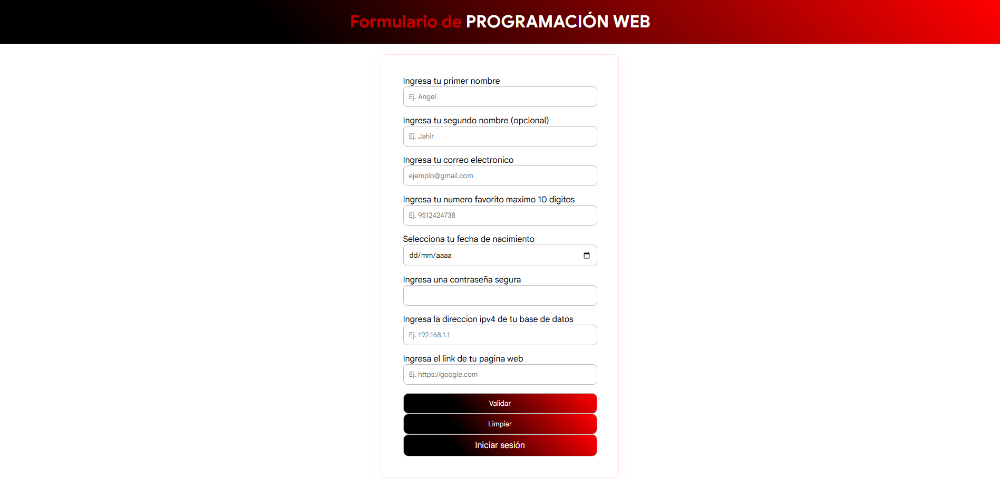
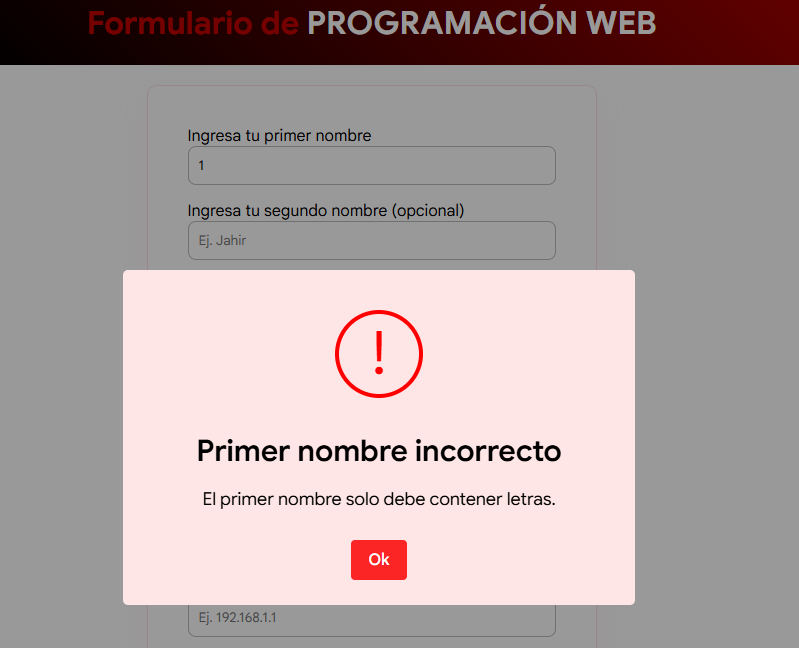
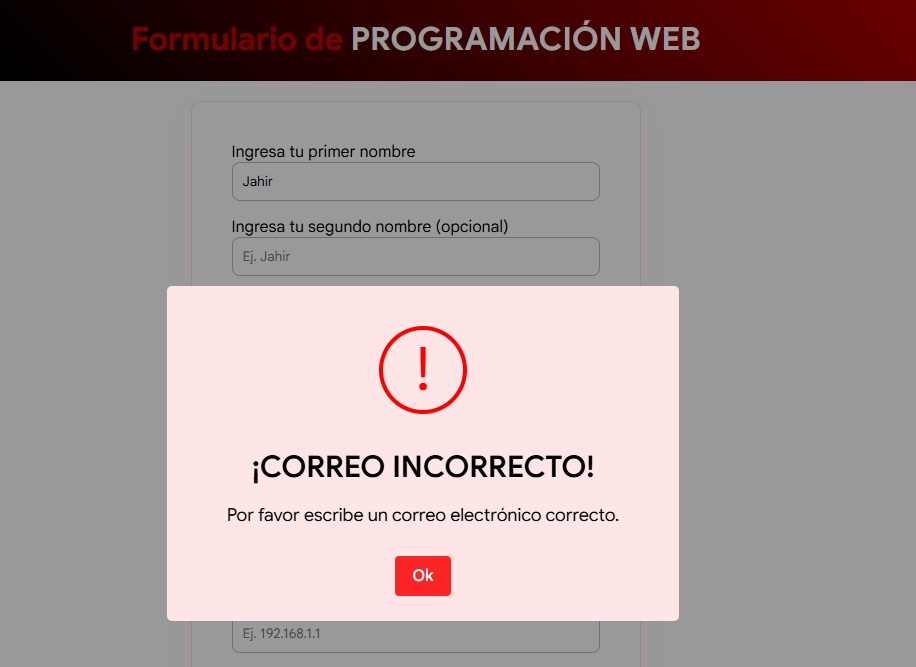
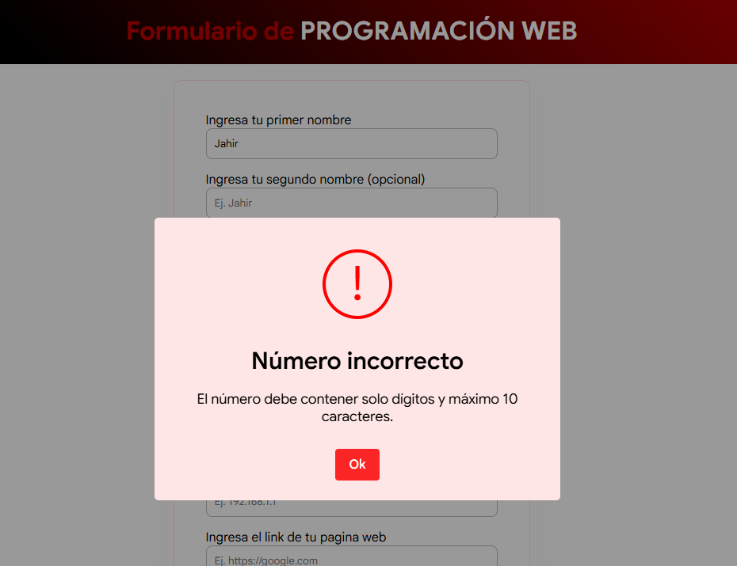
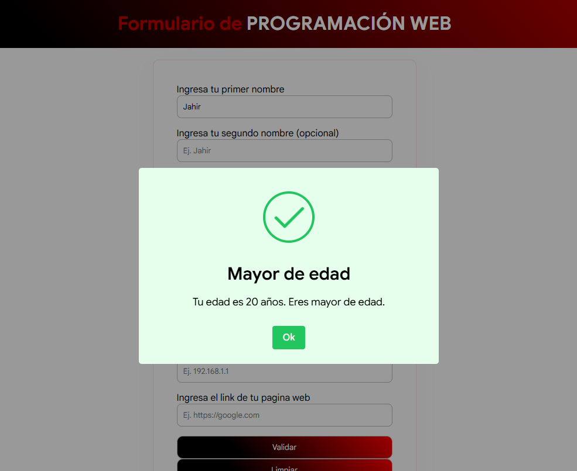
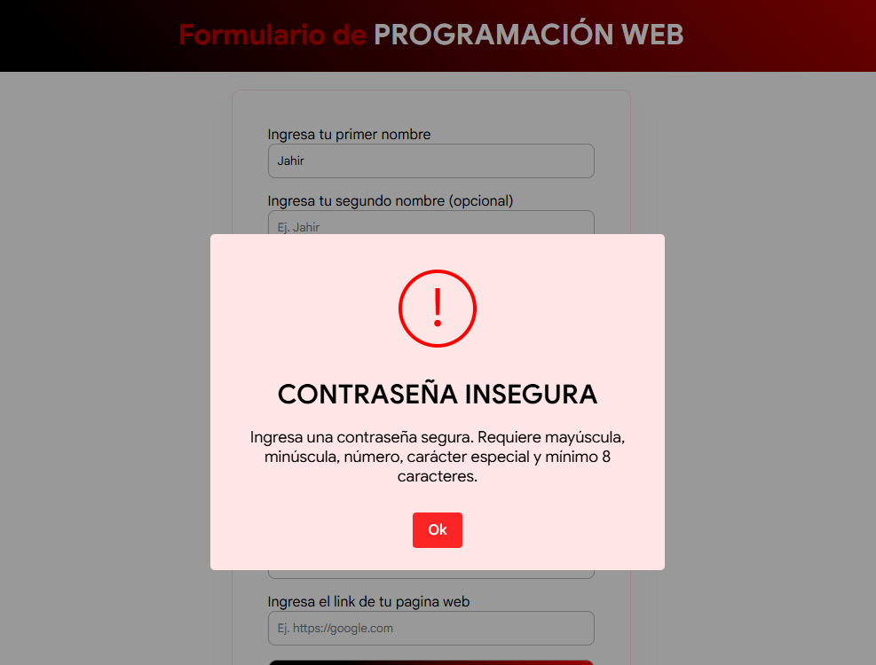
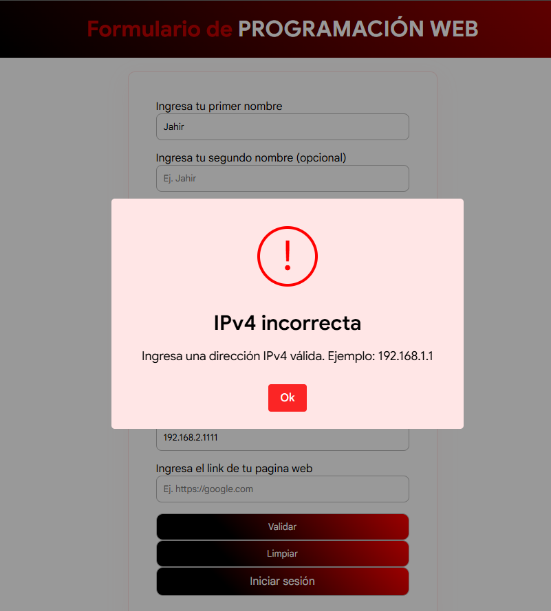
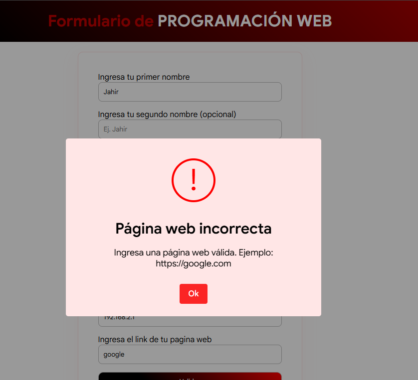
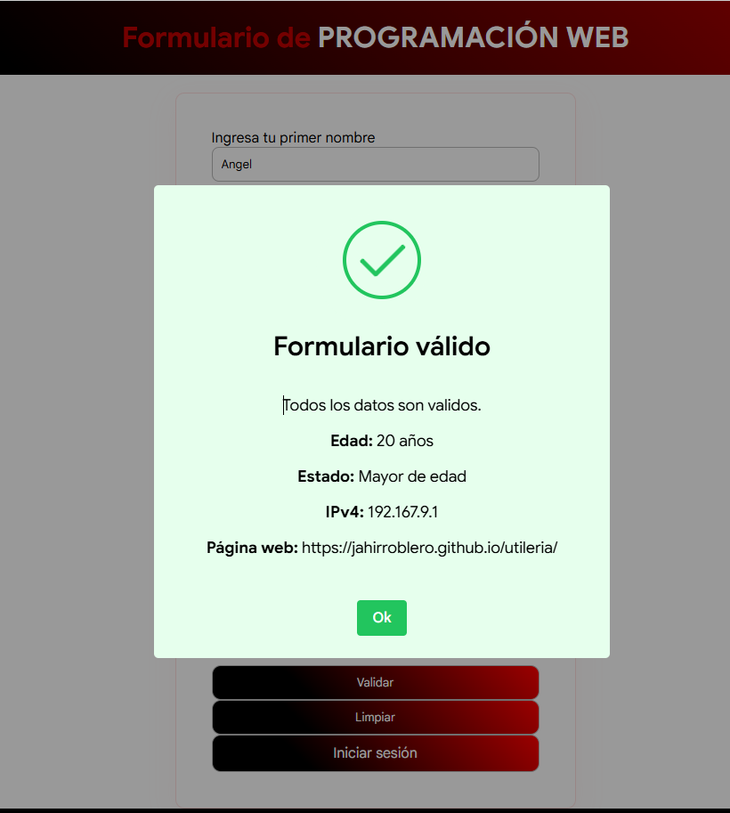

# Actividad 2 - Librería utileria.js

**Alumno:** Gomez Roblero Angel Jahir  
**Docente:** Adelina Martínez Nieto  
**Materia:** Programación Web  
**Actividad:** Librería JavaScript

## Objetivo

La librería `utileria.js` sirve para validar datos comunes dentro de formularios web usando JavaScript puro, sin frameworks y sin componentes visuales.
Esta librería permite validar correos electrónicos, nombres, números, fechas de nacimiento, mayoría de edad, contraseñas seguras, direcciones IPv4 y links de páginas web.
El objetivo es reutilizar las funciones en diferentes páginas, como el formulario principal y el login.

## Estructura del proyecto

```txt
ACTIVIDAD2/
│
├── README.md
├── index.html
├── login.html
│
├── css/
│   └── styles.css
│
├── js/
│   ├── utileria.js
│   ├── codigo.js
│   └── login.js
│
└── img/
    ├── calcularEdad.png
    ├── formularioPrincipal.png
    ├── validar10max.png
    ├── validarContraseña.png
    ├── validarCorreo.png
    ├── validarip.png
    ├── validarSoloLetras.png
    ├── validarWeb.png
    └── ventanaFinal.png
```

## Instalación

Para usar la librería en una página HTML, se debe enlazar el archivo `utileria.js`.

Si el archivo está en la misma carpeta:

```html
<script src="utileria.js"></script>
```

En este proyecto, como el archivo está dentro de la carpeta `js`, se usa así:

```html
<script src="js/utileria.js"></script>
```

Ejemplo completo usado en el formulario:

```html
<script src="https://cdn.jsdelivr.net/npm/sweetalert2@11"></script>
<script src="js/utileria.js"></script>
<script src="js/codigo.js"></script>
```

Ejemplo usado en el login:

```html
<script src="https://cdn.jsdelivr.net/npm/sweetalert2@11"></script>
<script src="js/utileria.js"></script>
<script src="js/login.js"></script>
```

## Funciones de la librería

La librería contiene 8 funciones.

| Función                                | Descripción                                                   |
| -------------------------------------- | ------------------------------------------------------------- |
| `validarCorreo(correo)`                | Valida el formato de un correo electrónico                    |
| `soloLetras(texto)`                    | Valida que el texto tenga solo letras, incluyendo acentos y ñ |
| `validarLongitud(numero, maxLongitud)` | Valida que un número no pase una longitud máxima              |
| `calcularEdad(fechaNacimiento)`        | Calcula la edad usando la fecha de nacimiento                 |
| `esMayorDeEdad(fechaNacimiento)`       | Valida si una persona tiene 18 años o más                     |
| `validarPassword(password)`            | Valida una contraseña segura                                  |
| `validarIPv4(ip)`                      | Valida una dirección IPv4                                     |
| `validarPaginaWeb(pagina)`             | Valida el formato de una página web                           |

## Código de la librería

```js
// Valida que el correo tenga formato correcto usando expresiones regulares
function validarCorreo(correo) {
  const correoTexto = String(correo).trim();

  const expresion = /^[^\s@]+@[^\s@]+\.[^\s@]+$/;

  return expresion.test(correoTexto);
}

// Valida que el texto tenga solo letras, incluyendo acentos y ñ
function soloLetras(texto) {
  const textoLimpio = String(texto).trim();

  const expresion = /^[A-Za-zÁÉÍÓÚáéíóúÑñÜü]+$/;

  return expresion.test(textoLimpio);
}

// Valida que sea un número y que no pase la longitud máxima
function validarLongitud(numero, maxLongitud) {
  const numeroTexto = String(numero).trim();

  const expresion = /^[0-9]+$/;

  return expresion.test(numeroTexto) && numeroTexto.length <= maxLongitud;
}

// Calcula la edad usando la fecha de nacimiento
function calcularEdad(fechaNacimiento) {
  const fechaTexto = String(fechaNacimiento).trim();

  const nacimiento = new Date(fechaTexto + "T00:00:00");
  const hoy = new Date();

  let edad = hoy.getFullYear() - nacimiento.getFullYear();

  const mesActual = hoy.getMonth();
  const diaActual = hoy.getDate();

  const mesNacimiento = nacimiento.getMonth();
  const diaNacimiento = nacimiento.getDate();

  if (
    mesActual < mesNacimiento ||
    (mesActual === mesNacimiento && diaActual < diaNacimiento)
  ) {
    edad--;
  }

  return edad;
}

// Valida si la edad es de 18 años o más
function esMayorDeEdad(fechaNacimiento) {
  const fechaTexto = String(fechaNacimiento).trim();

  return calcularEdad(fechaTexto) >= 18;
}

// Valida que la contraseña sea segura
function validarPassword(password) {
  const passwordTexto = String(password).trim();

  const expresion = /^(?=.*[A-Z])(?=.*[a-z])(?=.*\d)(?=.*[\W_])(?!.*\s).{8,}$/;

  return expresion.test(passwordTexto);
}

// Valida que una página web tenga formato correcto
function validarPaginaWeb(pagina) {
  const paginaTexto = String(pagina).trim();

  const expresion =
    /^(https?:\/\/)?(www\.)?[a-zA-Z0-9-]+(\.[a-zA-Z0-9-]+)+([\/?#][^\s]*)?$/;

  return expresion.test(paginaTexto);
}

// Valida que una dirección IPv4 tenga formato correcto
function validarIPv4(ip) {
  const ipTexto = String(ip).trim();

  const expresion =
    /^(25[0-5]|2[0-4][0-9]|1[0-9]{2}|[1-9]?[0-9])(\.(25[0-5]|2[0-4][0-9]|1[0-9]{2}|[1-9]?[0-9])){3}$/;

  return expresion.test(ipTexto);
}
```

## Ejemplos de uso

### Validar correo electrónico

```js
console.log(validarCorreo("usuario@gmail.com"));
// true

console.log(validarCorreo("usuario@gm"));
// false
```

### Validar solo letras

```js
console.log(soloLetras("Ángel"));
// true

console.log(soloLetras("Angel123"));
// false
```

### Validar longitud de número

```js
console.log(validarLongitud("9512424738", 10));
// true

console.log(validarLongitud("951242473899", 10));
// false

console.log(validarLongitud("951abc", 10));
// false
```

### Calcular edad

```js
console.log(calcularEdad("2004-05-10"));
// Retorna la edad calculada según la fecha actual
```

### Validar mayoría de edad

```js
console.log(esMayorDeEdad("2004-05-10"));
// true

console.log(esMayorDeEdad("2010-05-10"));
// false
```

### Validar contraseña segura

```js
console.log(validarPassword("Hola123*"));
// true

console.log(validarPassword("hola123"));
// false
```

### Validar página web

```js
console.log(validarPaginaWeb("https://google.com"));
// true

console.log(validarPaginaWeb("www.youtube.com"));
// true

console.log(validarPaginaWeb("pagina"));
// false
```

### Validar dirección IPv4

```js
console.log(validarIPv4("192.168.1.1"));
// true

console.log(validarIPv4("255.255.255.255"));
// true

console.log(validarIPv4("192.168.1.999"));
// false
```

## Uso en el formulario principal

En `index.html` se usa `utileria.js` para validar los datos del formulario.

Ejemplo de uso en `codigo.js`:

```js
if (!validarCorreo(email)) {
  Swal.fire({
    icon: "warning",
    title: "Correo incorrecto",
    text: "Por favor escribe un correo electrónico correcto.",
  });
  return;
}

if (!soloLetras(primerNombre)) {
  Swal.fire({
    icon: "warning",
    title: "Primer nombre incorrecto",
    text: "El primer nombre solo debe contener letras.",
  });
  return;
}

let edad = calcularEdad(fechaNacimiento);
let esMayor = esMayorDeEdad(fechaNacimiento);
```

El formulario valida:

```txt
- Primer nombre
- Segundo nombre opcional
- Correo electrónico
- Número favorito
- Fecha de nacimiento
- Contraseña segura
- Dirección IPv4
- Página web
```

## Uso en login.html

En `login.html` se reutilizan las funciones `validarCorreo()` y `validarPassword()`.

Ejemplo usado en `login.js`:

```js
if (!validarCorreo(email)) {
  Swal.fire({
    icon: "warning",
    title: "Correo incorrecto",
    text: "Por favor ingresa un correo electrónico válido.",
  });
  return;
}

if (!validarPassword(contraseña)) {
  Swal.fire({
    icon: "warning",
    title: "Contraseña insegura",
    text: "La contraseña debe tener mayúscula, minúscula, número, carácter especial y mínimo 8 caracteres.",
  });
  return;
}
```

## Capturas de pantalla

### Formulario principal

Aquí se muestra la página principal con los campos donde se harán las validaciones.



### Validar solo letras

Aquí se muestra que si en el nombre se escribe algún número, aparece una alerta indicando que solo se permiten letras.



### Validar correo electrónico

Aquí se muestra que si se ingresa un correo mal escrito, aparece una alerta pidiendo escribir un correo válido.



### Validar longitud máxima

Aquí se muestra que si en el número favorito se escriben más de 10 dígitos, aparece una alerta indicando el límite.



### Calcular edad

Aquí se muestra la edad calculada y si la persona es mayor o menor de edad.



### Validar contraseña

Aquí se muestra que si la contraseña no es segura, aparece una alerta.



### Validar dirección IPv4

Aquí se muestra que si no se coloca una dirección IPv4 válida, aparece una alerta.



### Validar link de página web

Aquí se muestra que si no se coloca un link correcto, aparece un error.



### Validación final

Si todos los datos son correctos, aparece una alerta final mostrando que el formulario fue validado.



## Conclusión

La librería `utileria.js` permite reutilizar funciones de validación en diferentes páginas web sin depender de frameworks.

Con esta actividad se integraron validaciones en un formulario principal, una ventana modal para mostrar la edad calculada y un login que reutiliza las funciones de correo y contraseña.
